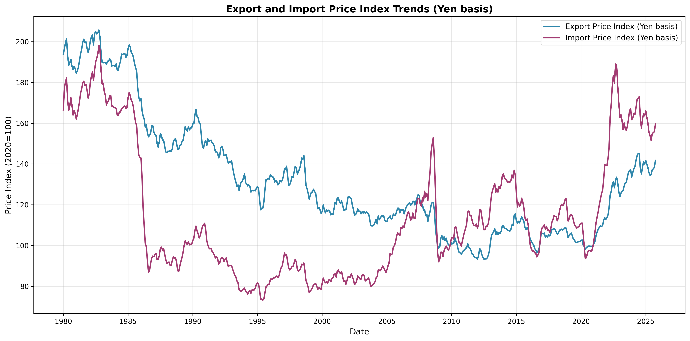
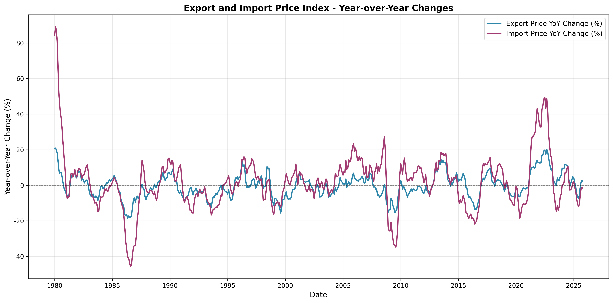
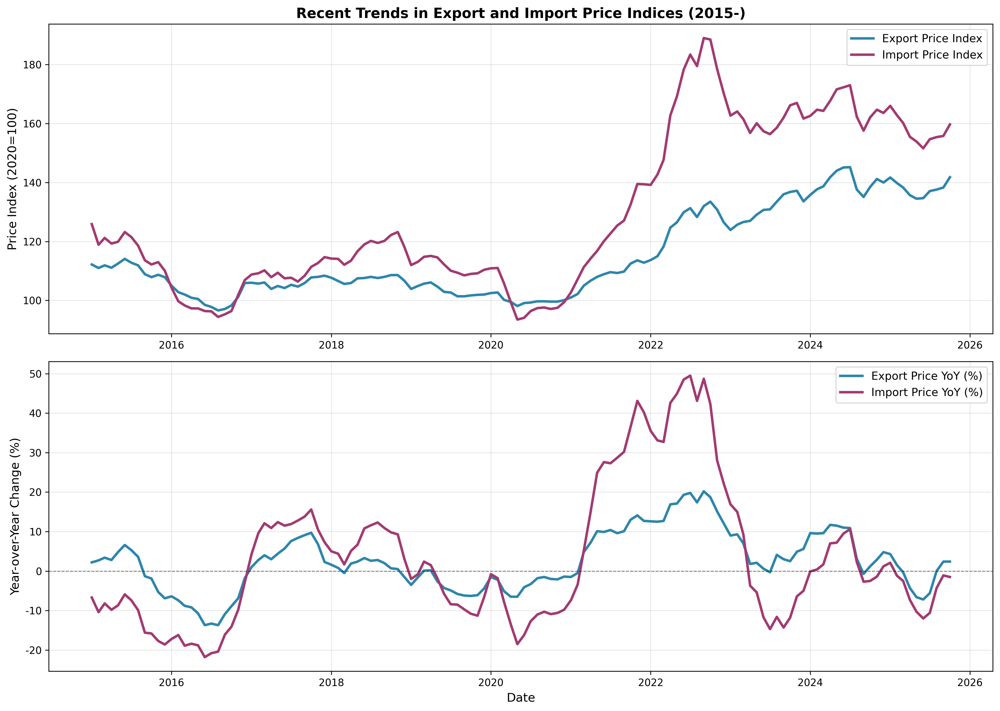
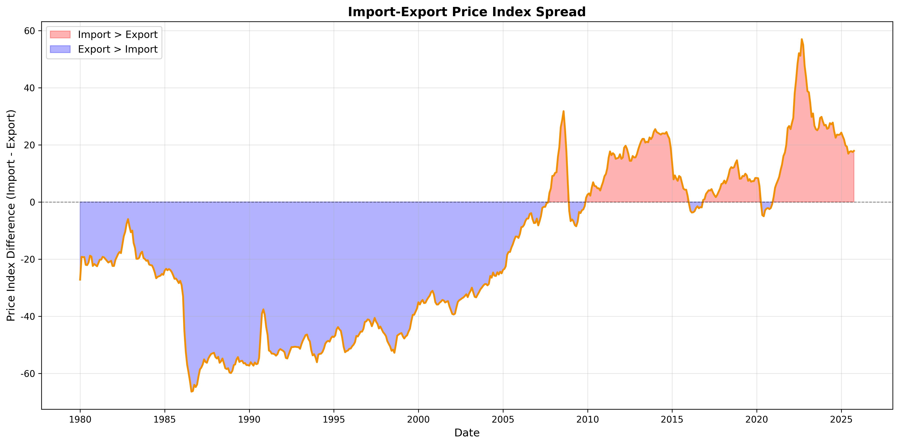

# 輸出入物価指数の分析
## 企業物価指数（円ベース）の推移と動向

---

## 目次

1. エグゼクティブサマリー
2. データ概要
3. 輸出物価指数の分析
4. 輸入物価指数の分析
5. 輸出入物価指数の比較
6. 主要トレンド
7. 結論と示唆

---

## 1. エグゼクティブサマリー

### 主要な発見事項

- **分析期間**: 1980年1月 ～ 2025年10月（45年以上のデータ）
- **輸出物価指数**: 比較的安定的な推移、平均前年比変動率 -0.3%
- **輸入物価指数**: 高いボラティリティ、平均前年比変動率 +1.8%
- **最新状況（2025年10月）**:
  - 輸出物価指数: 141.8（前年比+2.4%）
  - 輸入物価指数: 159.7（前年比-1.5%）

### キーポイント

- 輸入物価指数は輸出物価指数に比べて2倍以上の変動幅を持つ
- 近年の円安進行により両指数ともに上昇トレンド
- 2022年のピーク後、2025年にかけて調整局面に入っている

---

## 2. データ概要

### データソース
- **出所**: 日本銀行 企業物価指数
- **基準年**: 2020年 = 100
- **更新日**: 2025年11月13日
- **データ範囲**: 1980年1月 ～ 2025年10月（550ヶ月分）

### 分析対象
- **輸出物価指数**（円ベース・総平均）
- **輸入物価指数**（円ベース・総平均）

---

## 3. 輸出物価指数の分析

### 統計サマリー

| 統計量 | 値 |
|--------|------|
| 平均値（前年比） | -0.30% |
| 標準偏差 | 6.80% |
| 最大値（前年比） | +20.9% |
| 最小値（前年比） | -18.5% |
| 現在値（2025年10月） | 141.8 |

### 主要な特徴

1. **比較的安定的な変動**: 標準偏差6.8%と輸入物価に比べて安定
2. **長期的には緩やかな下落傾向**: 平均前年比-0.3%
3. **為替の影響**: 円安局面で上昇、円高局面で下落

### 可視化

---

## 4. 輸入物価指数の分析

### 統計サマリー

| 統計量 | 値 |
|--------|------|
| 平均値（前年比） | +1.83% |
| 標準偏差 | 15.61% |
| 最大値（前年比） | +89.2% |
| 最小値（前年比） | -45.8% |
| 現在値（2025年10月） | 159.7 |

### 主要な特徴

1. **高いボラティリティ**: 標準偏差15.6%、輸出物価の2.3倍
2. **極端な変動**: 最大+89.2%から最小-45.8%まで変動
3. **資源価格との連動性**: 原油価格などの国際商品市況の影響を強く受ける

### 可視化

---

## 5. 輸出入物価指数の比較

### 指数レベルの比較（2020年=100）

| 時期 | 輸出物価指数 | 輸入物価指数 | スプレッド |
|------|--------------|--------------|------------|
| 2020年平均 | 100.0 | 100.0 | 0.0 |
| 2022年ピーク | ~150 | ~180 | +30 |
| 2025年10月 | 141.8 | 159.7 | +17.9 |

### 主要な観察点

1. **スプレッド拡大**: 輸入物価が輸出物価を継続的に上回る
2. **交易条件の悪化**: 輸入コスト上昇が輸出価格上昇を上回る
3. **近年の改善**: 2022年ピーク以降、スプレッドは縮小傾向

### 可視化

---

## 6. 主要トレンド

### 歴史的推移の5つの局面

#### 1. 第2次石油危機期（1980年代初頭）
- 輸入物価の急激な上昇（前年比+89%を記録）
- インフレーション圧力が顕著

#### 2. 円高進行期（1980年代後半～1990年代）
- 両指数ともに低下傾向
- プラザ合意後の円高が価格低下を促進

#### 3. デフレ期（1990年代後半～2000年代）
- 長期にわたる価格下落
- 輸出入物価ともにマイナス圏で推移

#### 4. 資源高騰期（2000年代後半～2010年代）
- リーマンショック前後で大きな変動
- 中国経済成長に伴う資源価格上昇

#### 5. コロナ後インフレ期（2020年代）
- パンデミック後のサプライチェーン混乱
- ウクライナ情勢による資源価格高騰
- 急速な円安進行

### 可視化

---

## 7. 結論と示唆

### 主要な結論

1. **構造的な特徴**
   - 輸入物価の変動幅は輸出物価の約2.3倍
   - 輸入物価は国際商品市況と為替の影響を強く受ける
   - 輸出物価は比較的安定的に推移

2. **現在の状況（2025年10月時点）**
   - 両指数ともに2022年ピークから調整局面
   - 輸出物価: 141.8（前年比+2.4%）
   - 輸入物価: 159.7（前年比-1.5%）
   - 交易条件は依然として厳しい状況

3. **将来への示唆**
   - 輸入コスト上昇圧力は一服も、高止まり継続
   - 為替動向が引き続き重要な決定要因
   - エネルギー価格の動向に要注視

### 政策的インプリケーション

- **企業経営**: 輸入コスト管理と価格転嫁戦略の重要性
- **マクロ経済**: 交易条件悪化による実質所得への影響
- **金融政策**: 輸入インフレ圧力と国内需要のバランス

---

## 付録: 技術的詳細

### データ処理

- **エンコーディング**: Shift-JIS
- **データクリーニング**: 欠損値処理済み
- **可視化ツール**: Python (pandas, matplotlib)

### ファイル一覧

1. `企業物価指数円ベースpr01_m_1.csv` - 元データ
2. `analyze_price_index.py` - データ分析スクリプト
3. `create_visualizations.py` - グラフ作成スクリプト
4. `summary_statistics.csv` - 統計サマリー
5. `*.png` - 各種グラフファイル
6. `presentation.md` - 本プレゼン資料

---

## お問い合わせ・追加分析

追加の分析や詳細なデータが必要な場合は、以下の項目について検討可能です：

- 個別品目別の分析
- 地域別の輸出入物価動向
- 為替レートとの相関分析
- 予測モデルの構築
- 業種別への影響分析

---

**分析実施日**: 2025年11月13日
**データ更新日**: 2025年11月13日
**分析対象期間**: 1980年1月 ～ 2025年10月
