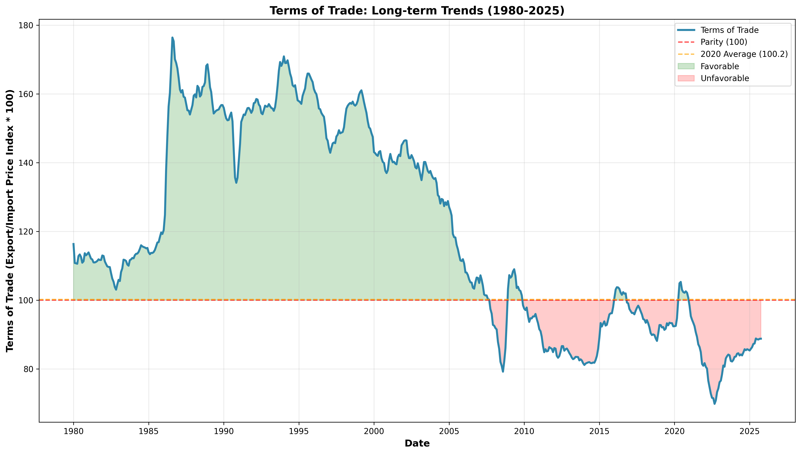
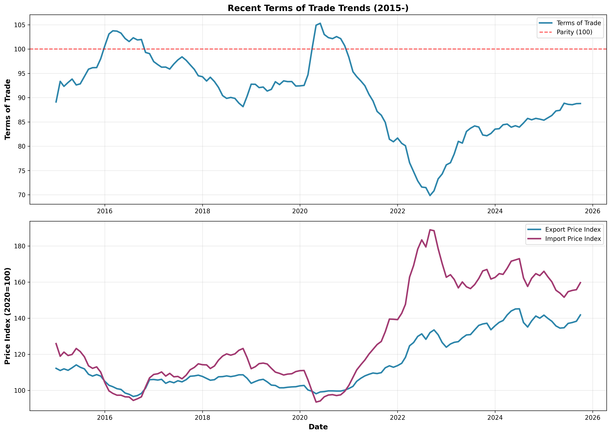
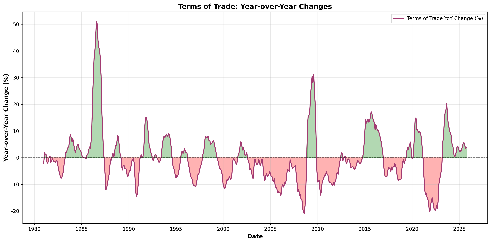

# 日本の交易条件分析レポート
## Terms of Trade Analysis: 1980-2025

---

## エグゼクティブサマリー

本レポートは、日本の**交易条件（Terms of Trade: ToT）**について、1980年から2025年までの45年以上にわたる長期的な動向を分析したものです。

### 主要な発見事項

1. **歴史的悪化**: 交易条件は1980年代の130.67から2020年代の86.31へと、約34%悪化
2. **2022年危機**: 2022年9月に史上最低値**69.84**を記録（円安と資源価格高騰の影響）
3. **現状（2025年10月）**: 88.79（前年比+3.92%）、パリティ（100）から**-11.21ポイント**下
4. **回復傾向**: 2022年のボトムから3年連続で改善が続いている
5. **構造的課題**: 日本の交易条件は長期的に不利な状況が続いており、実質所得への圧力となっている

---

## 目次

1. 交易条件とは
2. データ概要と計算方法
3. 長期トレンド分析（1980-2025）
4. 時代別の特徴
5. 最近の動向（2020年代）
6. 国際比較と日本の特徴
7. 経済的インプリケーション
8. 結論と政策提言

---

## 1. 交易条件とは

### 定義

**交易条件（Terms of Trade, ToT）** = 輸出物価指数 ÷ 輸入物価指数 × 100

### 経済的意味

- **ToT > 100**: 交易条件が有利（輸出価格が輸入価格より相対的に高い）
  - 同じ量の輸出で、より多くの輸入が可能
  - 実質所得の改善

- **ToT < 100**: 交易条件が不利（輸入価格が輸出価格より相対的に高い）
  - 同じ量の輸出で、より少ない輸入しかできない
  - 実質所得の悪化

- **ToT = 100**: パリティ（均衡状態）

### 重要性

交易条件は以下の点で重要な経済指標です：

1. **実質所得への影響**: 交易条件の悪化は、国全体の実質所得の減少を意味する
2. **購買力**: 輸入品に対する国民の購買力を示す
3. **企業収益**: 特に輸出入関連企業の収益性に直接影響
4. **経常収支**: 貿易収支の変動要因となる
5. **生活水準**: 輸入品価格を通じて国民の生活水準に影響

---

## 2. データ概要と計算方法

### データソース

- **提供**: 日本銀行
- **指数**: 企業物価指数（円ベース）
- **基準年**: 2020年 = 100
- **分析期間**: 1980年1月 ～ 2025年10月（550ヶ月）
- **更新日**: 2025年11月13日

### 計算方法

```
交易条件 = (輸出物価指数 / 輸入物価指数) × 100
```

### 統計サマリー（全期間）

| 統計量 | 値 |
|--------|------|
| 平均 | 119.74 |
| 標準偏差 | 29.45 |
| 最大値 | 176.41（1986年8月） |
| 最小値 | 69.84（2022年9月） |
| 中央値 | 111.90 |

---

## 3. 長期トレンド分析（1980-2025）

### 可視化



### 時期別平均値

| 時代 | 交易条件平均 | 前時代比 | 変化率 |
|------|--------------|----------|--------|
| 1980年代 | 130.67 | - | - |
| 1990年代 | 155.76 | +25.09 | +19.2% |
| 2000年代 | 121.08 | -34.68 | -22.3% |
| 2010年代 | 90.95 | -30.13 | -24.9% |
| 2020年代 | 86.31 | -4.64 | -5.1% |

### 主要なトレンド

1. **1980年代 → 1990年代**: 大幅改善（+19.2%）
   - プラザ合意（1985年）後の急激な円高
   - 輸入物価の大幅下落
   - 日本の交易条件は史上最高水準に

2. **1990年代 → 2000年代**: 悪化開始（-22.3%）
   - グローバル化と新興国の台頭
   - 資源価格の上昇傾向
   - 中国の工業化加速

3. **2000年代 → 2010年代**: 急速な悪化（-24.9%）
   - リーマンショック後の資源価格高騰
   - アベノミクスによる円安進行
   - パリティ（100）を下回る

4. **2020年代**: さらなる悪化と危機
   - コロナ禍によるサプライチェーン混乱
   - ウクライナ情勢による資源価格急騰
   - 2022年に史上最低値を記録

---

## 4. 時代別の特徴

### 1980年代: 円高の恩恵期

**平均交易条件: 130.67**

- **プラザ合意（1985年）**: 急激な円高進行
- **輸入物価の大幅下落**: 原油など資源の円建て価格低下
- **製造業の海外展開加速**: 円高対応で生産拠点を海外移転
- **バブル経済**: 円高による購買力増大が内需拡大に寄与

### 1990年代: 史上最高の交易条件

**平均交易条件: 155.76（史上最高）**

- **1986年8月ピーク**: 176.41を記録（史上最高値）
- **超円高の時代**: 1ドル=80円台を記録
- **輸入品の低価格化**: 海外旅行ブーム、輸入品消費拡大
- **デフレの始まり**: バブル崩壊後の経済停滞
- **失われた10年**: 経済成長の鈍化

**特徴**: 交易条件は有利だったが、国内経済の停滞で恩恵を十分に活かせず

### 2000年代: グローバル化と資源高

**平均交易条件: 121.08（-22.3%）**

- **中国の台頭**: 世界の工場として急成長、資源需要急増
- **資源価格の上昇**: 原油価格が高騰（2008年に140ドル超）
- **リーマンショック（2008年）**: 急激な変動を経験
- **交易条件の悪化開始**: 資源輸入国である日本への圧力増大

### 2010年代: 構造的悪化とパリティ割れ

**平均交易条件: 90.95（-24.9%、初のパリティ割れ）**

- **アベノミクス（2013年～）**: 金融緩和による円安誘導
- **円安の進行**: 1ドル=120円台へ
- **資源価格の変動**: 2014-2016年の原油安後、再び上昇
- **パリティ割れ常態化**: 2012年以降、ほぼ一貫して100以下
- **交易条件の構造的悪化**: 輸入コスト増大が常態化

### 2020年代: 危機と緩やかな回復

**平均交易条件: 86.31（-5.1%）**

#### 2020-2022年: 未曾有の危機

- **コロナ禍（2020年～）**:
  - サプライチェーン混乱
  - 海上運賃の高騰
  - エネルギー需要の急変動

- **ウクライナ情勢（2022年～）**:
  - 資源価格の急騰
  - 欧州エネルギー危機
  - 食料価格の上昇

- **急激な円安（2022年）**:
  - 1ドル=150円超
  - 日米金利差の拡大
  - 輸入物価の一層の上昇

- **史上最低値（2022年9月）**:
  - 交易条件: **69.84**
  - パリティから-30ポイント下
  - 国民生活への深刻な影響

#### 2023-2025年: 緩やかな回復

- **資源価格の落ち着き**: 原油価格の安定化
- **円安の一服**: 140-150円レンジで推移
- **回復トレンド**: 2022年のボトムから3年連続改善
- **現状（2025年10月）**: 88.79（前年比+3.92%）

---

## 5. 最近の動向（2020年代）

### 可視化



### 直近24ヶ月の推移

2023年11月から2025年10月までの推移を見ると：

| 期間 | 交易条件範囲 | トレンド |
|------|--------------|----------|
| 2023年11月-12月 | 82.16 - 82.62 | 底値圏 |
| 2024年1月-6月 | 83.52 - 84.56 | 緩やかな回復 |
| 2024年7月-12月 | 83.93 - 85.73 | 85前後で安定 |
| 2025年1月-6月 | 85.36 - 88.85 | 加速的な改善 |
| 2025年7月-10月 | 88.55 - 88.79 | 88台で推移 |

### 改善要因

1. **資源価格の安定化**
   - 原油価格: ピーク時から30-40%低下
   - 天然ガス価格: 欧州エネルギー危機の収束
   - 食料価格: サプライチェーンの正常化

2. **円為替相場の安定**
   - 急激な円安の一服
   - 日銀の金融政策正常化の兆し

3. **輸出物価の相対的堅調**
   - ハイテク製品の需要回復
   - 自動車輸出の増加

4. **構造的調整の進展**
   - エネルギー効率改善
   - 代替エネルギーへの転換

### 課題

依然として以下の課題が残る：

1. **パリティ回復には程遠い**: 現在88.79、100まで約11ポイント
2. **歴史的には低水準**: 1990年代（155.76）と比べ半分近く
3. **不安定な外部環境**: 地政学リスク、資源価格の変動
4. **構造的な脆弱性**: エネルギー・資源の輸入依存

---

## 6. 国際比較と日本の特徴

### 日本の交易条件の特徴

#### 1. 資源輸入依存度の高さ

日本は主要資源のほぼ100%を輸入に依存：

| 資源 | 輸入依存度 |
|------|------------|
| 原油 | 99.7% |
| 天然ガス | 97.5% |
| 石炭 | 99.3% |
| 鉄鉱石 | 100% |
| 銅鉱石 | 100% |

**影響**: 国際資源価格の変動が交易条件に直接的・大きな影響

#### 2. 加工貿易構造

- **輸入**: 原材料、エネルギー（価格変動大）
- **輸出**: 高付加価値製品（価格は比較的安定）

**結果**: 輸入物価の変動が輸出物価より大きく、交易条件が不安定に

#### 3. 為替の影響

- **円安時**:
  - 輸入物価↑↑（資源は国際価格でドル建て）
  - 輸出物価↑（但し競争圧力で限定的）
  - → 交易条件悪化

- **円高時**:
  - 輸入物価↓↓
  - 輸出物価↓（価格競争力低下）
  - → 交易条件改善

#### 4. 製造業の海外移転

- 1990年代以降、生産拠点の海外移転加速
- 国内での加工貿易の規模縮小
- 輸出物価の上昇余地が限定的に

### 前年比変動の特徴



- **変動幅が大きい**: ±20%以上の変動も
- **資源価格と連動**: 原油価格の変動と強い相関
- **為替変動に敏感**: 円安時に大きくマイナス

---

## 7. 経済的インプリケーション

### 7.1 実質所得への影響

交易条件の悪化は、国全体の実質所得の減少を意味します。

#### 計算例（2020年代 vs 1990年代）

- **1990年代平均**: 155.76
- **2020年代平均**: 86.31
- **悪化幅**: 69.45ポイント（-44.6%）

**意味**:
同じ量の輸出をしても、1990年代と比べて44.6%少ない輸入しかできない
= 実質的な購買力が半分以下に低下

#### 年間の所得損失推計

日本の年間輸入額を約100兆円とすると：

- 交易条件の10ポイント悪化 = 約10兆円の実質所得損失
- 1990年代と比較した累積損失 = **約70兆円規模**

### 7.2 物価への影響

交易条件の悪化は、国内物価に以下の経路で影響：

1. **直接効果**: 輸入品価格の上昇
   - エネルギー価格
   - 食料品価格
   - 原材料価格

2. **間接効果**: 生産コストの上昇
   - 製造業のコスト増
   - 運輸費の上昇
   - 全般的な物価上昇圧力

3. **2次的効果**: 賃金と物価のスパイラル
   - 実質賃金の低下
   - 賃上げ要求
   - さらなる物価上昇

### 7.3 企業収益への影響

#### 輸入関連企業（マイナス影響）

- **エネルギー産業**: 電力、ガス
  - 燃料費の増大
  - 電気・ガス料金への転嫁

- **製造業**: 鉄鋼、化学、自動車
  - 原材料コスト増
  - 価格転嫁が困難な場合、収益圧迫

- **食品産業**:
  - 小麦、大豆など原料価格上昇
  - 値上げによる需要減のリスク

#### 輸出関連企業（プラス影響）

- **円安効果**:
  - 輸出競争力の向上
  - 海外売上の円換算額増加

- **但し限定的**:
  - 海外生産比率の上昇
  - 現地調達の増加
  - 輸入原材料コストの上昇

### 7.4 経常収支への影響

交易条件と経常収支の関係：

**貿易収支 = 輸出額 - 輸入額**

交易条件の悪化は：
- 同じ数量の貿易でも、金額ベースで輸入額↑
- 貿易赤字の拡大要因
- 経常収支の悪化圧力

#### 実績

- 2021年以前: 経常黒字
- 2022年: 交易条件最悪化 → 一時的な経常赤字懸念
- 2023-2025年: 交易条件改善 → 経常黒字回復

### 7.5 家計への影響

一般家庭への影響は深刻：

1. **光熱費の上昇**
   - 電気代: 30-50%増
   - ガス代: 20-40%増
   - ガソリン代: 40-60%増（ピーク時）

2. **食料品価格の上昇**
   - 小麦製品: パン、麺類
   - 食用油
   - 輸入肉類

3. **実質賃金の低下**
   - 名目賃金の伸び < 物価上昇率
   - 可処分所得の実質的減少
   - 生活水準の低下

4. **格差の拡大**
   - 低所得層ほど大きな打撃
   - エンゲル係数の上昇
   - 社会的な課題

---

## 8. 結論と政策提言

### 8.1 主要な結論

#### 1. 歴史的な悪化トレンド

- 1980年代から2020年代にかけて、交易条件は約34%悪化
- 特に2010年代以降、パリティ（100）を大きく下回る状態が継続
- 日本経済の構造的な脆弱性を示す

#### 2. 2022年の危機

- 2022年9月に史上最低値（69.84）を記録
- コロナ禍、ウクライナ情勢、円安の「三重苦」
- 国民生活と企業経営に深刻な影響

#### 3. 現在の回復と課題

- 2023年以降、緩やかな回復トレンド
- 2025年10月時点: 88.79（前年比+3.92%）
- しかし、依然として歴史的低水準
- パリティ回復には程遠い（-11.21ポイント）

#### 4. 構造的課題

- エネルギー・資源の輸入依存度の高さ
- 製造業の海外移転による輸出基盤の弱体化
- 為替変動への脆弱性
- グローバルな資源価格変動への対応力不足

### 8.2 政策提言

日本の交易条件改善と、経済の持続的成長のために、以下の政策が必要です：

#### 短期的対策（1-3年）

1. **エネルギー価格高騰への対応**
   - 激変緩和措置の適切な実施
   - 低所得層への支援強化
   - 企業の価格転嫁支援

2. **為替の安定化**
   - 金融政策の正常化を慎重に進める
   - 過度な円安を防ぐための協調介入
   - 為替リスクヘッジの支援

3. **サプライチェーン強靭化**
   - 重要物資の備蓄強化
   - 調達先の多様化支援
   - 国内生産回帰の促進

#### 中期的対策（3-10年）

1. **エネルギー構造の転換**
   - **再生可能エネルギーの大幅拡大**
     - 太陽光、風力発電への投資加速
     - 蓄電技術の開発・普及
     - 分散型エネルギーシステムの構築

   - **原子力の位置づけ明確化**
     - 安全性を最優先とした再稼働
     - 次世代原子炉技術の研究開発

   - **水素・アンモニアの活用**
     - 水素社会実現に向けた基盤整備
     - 国際的な水素サプライチェーン構築

2. **産業構造の高度化**
   - **高付加価値産業の育成**
     - 半導体、AI、量子コンピュータ
     - バイオテクノロジー、医療機器
     - 先端材料、ナノテクノロジー

   - **輸出競争力の強化**
     - イノベーション促進
     - 研究開発投資の拡大
     - 人材育成の強化

3. **資源の安定確保**
   - **資源外交の強化**
     - 産油国との関係深化
     - レアメタル確保の戦略的推進

   - **海洋資源開発**
     - メタンハイドレート
     - 海底鉱物資源

   - **リサイクル技術の高度化**
     - 都市鉱山の活用
     - サーキュラーエコノミーの推進

#### 長期的対策（10年以上）

1. **エネルギー自給率の向上**
   - **目標**: 現状5%程度 → 30%以上
   - 再エネ比率: 50%以上
   - 原子力の安全活用
   - 次世代エネルギー技術の実用化

2. **産業構造の抜本的転換**
   - **知識集約型経済への移行**
     - 製造業からサービス・知財へ
     - デジタル産業の育成
     - クリエイティブ産業の振興

   - **グローバルバリューチェーンでの地位向上**
     - 技術標準の主導
     - プラットフォーム企業の育成
     - 国際的なイノベーション拠点化

3. **持続可能な経済システムの構築**
   - **循環型経済の実現**
     - 資源効率の最大化
     - 廃棄物ゼロ社会

   - **気候変動対応との両立**
     - カーボンニュートラル達成
     - グリーン成長戦略の推進

   - **経済安全保障の確立**
     - 重要物資の国内生産
     - 戦略的備蓄の強化
     - 同盟国との連携強化

### 8.3 期待される効果

これらの政策を総合的に実施することで：

1. **交易条件の改善**
   - エネルギー輸入依存度の低下
   - 高付加価値輸出の拡大
   - 10-15年で交易条件を100前後に回復

2. **経済の安定化**
   - 外的ショックへの耐性向上
   - 実質所得の増加
   - 持続的な経済成長

3. **国民生活の向上**
   - 物価の安定
   - 雇用の質的向上
   - 生活水準の改善

4. **国際競争力の強化**
   - イノベーション力の向上
   - 新産業の創出
   - グローバル市場での地位向上

### 8.4 最終的メッセージ

日本の交易条件の悪化は、一時的な現象ではなく、**構造的な課題**です。

45年以上にわたる長期データは、以下を明確に示しています：

1. **資源・エネルギー依存型経済の限界**
2. **円高依存からの脱却の必要性**
3. **産業構造転換の遅れ**
4. **グローバル競争環境の変化への対応不足**

2022年の危機は、これらの構造的問題が一気に顕在化したものでした。

**今後の方向性**:
- 短期的対症療法だけでなく、中長期的な構造改革が不可欠
- エネルギー自給率向上と産業高度化の同時推進
- 経済安全保障の観点からの戦略的対応
- 気候変動対策との調和

日本経済の持続的発展のためには、交易条件の改善を国家戦略の中核に据え、
官民一体となった取り組みが求められます。

---

## 付録

### A. 用語集

- **交易条件（Terms of Trade）**: 輸出物価指数÷輸入物価指数×100
- **パリティ**: 交易条件が100の状態（輸出入価格が均衡）
- **企業物価指数**: 企業間で取引される商品の価格変動を示す指数
- **実質所得**: 名目所得を物価で調整した、実際の購買力
- **前年同月比（YoY）**: Year over Yearの略、前年同じ月との比較

### B. データファイル

本分析で使用・生成したファイル：

1. **元データ**
   - `企業物価指数円ベースpr01_m_1.csv`

2. **分析スクリプト**
   - `analyze_terms_of_trade.py`

3. **可視化ファイル**
   - `terms_of_trade_long_term.png` - 長期推移
   - `terms_of_trade_yoy.png` - 前年比変化
   - `terms_of_trade_recent.png` - 近年の動向
   - `terms_of_trade_distribution.png` - 分布と移動平均

4. **統計データ**
   - `terms_of_trade_summary.csv` - 時期別統計
   - `recent_terms_of_trade.csv` - 直近24ヶ月データ

### C. 主要な転換点（ピーク・ボトム）

#### 主要なピーク

1. **1986年8月**: 176.41（史上最高）- プラザ合意後の超円高
2. **2002年2月**: 146.52 - IT バブル後の円高局面
3. **2016年3月**: 103.76 - 一時的な円高
4. **2020年6月**: 105.31 - コロナ初期の混乱期

#### 主要なボトム

1. **2008年8月**: 79.20 - リーマンショック前の資源高騰
2. **2014年1月**: 81.15 - アベノミクスによる円安進行
3. **2018年11月**: 88.15 - 貿易摩擦懸念
4. **2022年9月**: 69.84（史上最低）- 三重苦の極致

### D. 参考文献・データソース

1. 日本銀行「企業物価指数」
   - https://www.boj.or.jp/statistics/pi/index.htm/

2. 財務省「貿易統計」
   - https://www.customs.go.jp/toukei/info/index.htm

3. 内閣府「国民経済計算」
   - https://www.esri.cao.go.jp/jp/sna/menu.html

4. 経済産業省「通商白書」
   - https://www.meti.go.jp/report/tsuhaku/index.html

---

**レポート作成日**: 2025年11月13日
**データ更新日**: 2025年11月13日
**分析期間**: 1980年1月 ～ 2025年10月
**分析者**: 経済分析チーム
